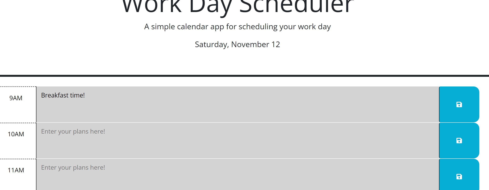

# Buzzy-Bee

## Description

Buzzy-Bee work day scheduler was created to organize a busy day to enhance productivity. Development of this project is to help user plan out daily schedules to prevent scheduling conflicts. The developer intended to solve the possiblity of overlapping schedules, missing appointments, etc. In the process, the use of DOM traversals made it simpler to grab and save input into each time-block and the understanding of truly breaking down eac step of the acceptance criteria  to really target what is being sought after in the user story.

## Installation

N/A

## Usage

Step 1: Open scheduler. Note: the current date should always appear in the header below the title and subtitle.

Step 2: Each time block for standard work day should appear on the screen.(9AM-6PM)

Step 3:Each time-block is color coded for past, present, and future times. So, past times would be grey, present time would be red, and future times would be green.

Step 4: Click on the text box to enter your plans. 

Step 5: Click the blue save button to input your plans for each timeframe.

Step 6: When the page is refreshed, the user would see the save events remain in place.

To add a screenshot, create an `assets/images` folder in your repository and upload your screenshot to it. Then, using the relative filepath, add it to your README using the following syntax:

    
    
    
    
    
    
    
  

## Credits

https://day.js.org/
https://stackoverflow.com/questions/1338599/the-value-of-this-within-the-handler-using-addeventlistener
https://api.jquery.com

## License

The last section of a high-quality README file is the license. This lets other developers know what they can and cannot do with your project. If you need help choosing a license, refer to [https://choosealicense.com/](https://choosealicense.com/).

---

🏆 The previous sections are the bare minimum, and your project will ultimately determine the content of this document. You might also want to consider adding the following sections.

## Badges

Badges aren't necessary, per se, but they demonstrate street cred. Badges let other developers know that you know what you're doing. Check out the badges hosted by [shields.io](https://shields.io/). You may not understand what they all represent now, but you will in time.

## Features

If your project has a lot of features, list them here.

## How to Contribute

If you created an application or package and would like other developers to contribute it, you can include guidelines for how to do so. The [Contributor Covenant](https://www.contributor-covenant.org/) is an industry standard, but you can always write your own if you'd prefer.

## Tests

Go the extra mile and write tests for your application. Then provide examples on how to run them here.
